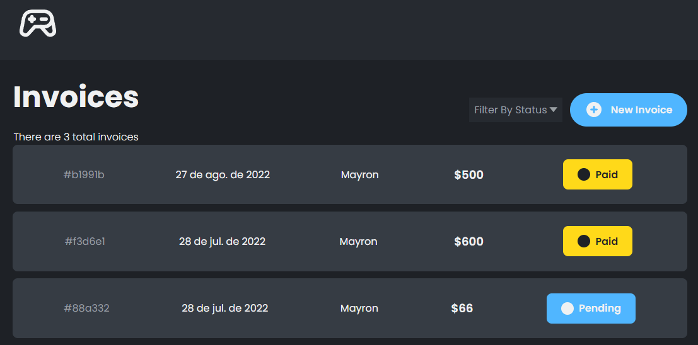

# Invoice App with Vue + Firebase



A CRUD Invoice App with [Firebase](https://firebase.google.com/) as backend


## Built with

- [Typescript](https://www.typescriptlang.org/)
- [Vue](https://vuejs.org/)
- [Vite](https://vitejs.dev/)
- [pNpM](https://pnpm.io/)
- [Pinia](https://pinia.vuejs.org/)
- [Vue Router](https://router.vuejs.org/)
- [Firebase](https://firebase.google.com/)

## Get Started

- Get the project code

```bash
git clone https://github.com/mayronH/vue-invoice
```

- Installation of dependencies

```bash
cd vue-invoice

pnpm install

```

- run

```bash
pnpm dev
```

- build

```bash
pnpm build
```
## Acknowledgments

This project is based on the tutorial of [John Komarnicki](https://www.youtube.com/watch?v=vsJtN54aA7w)
